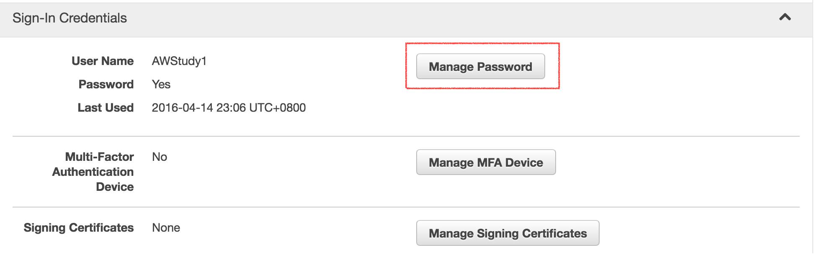
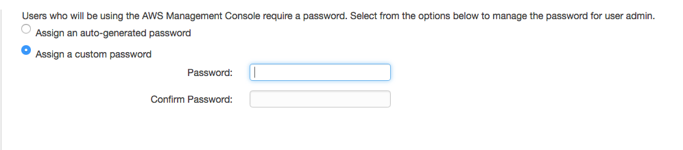
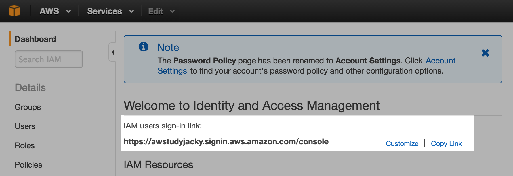
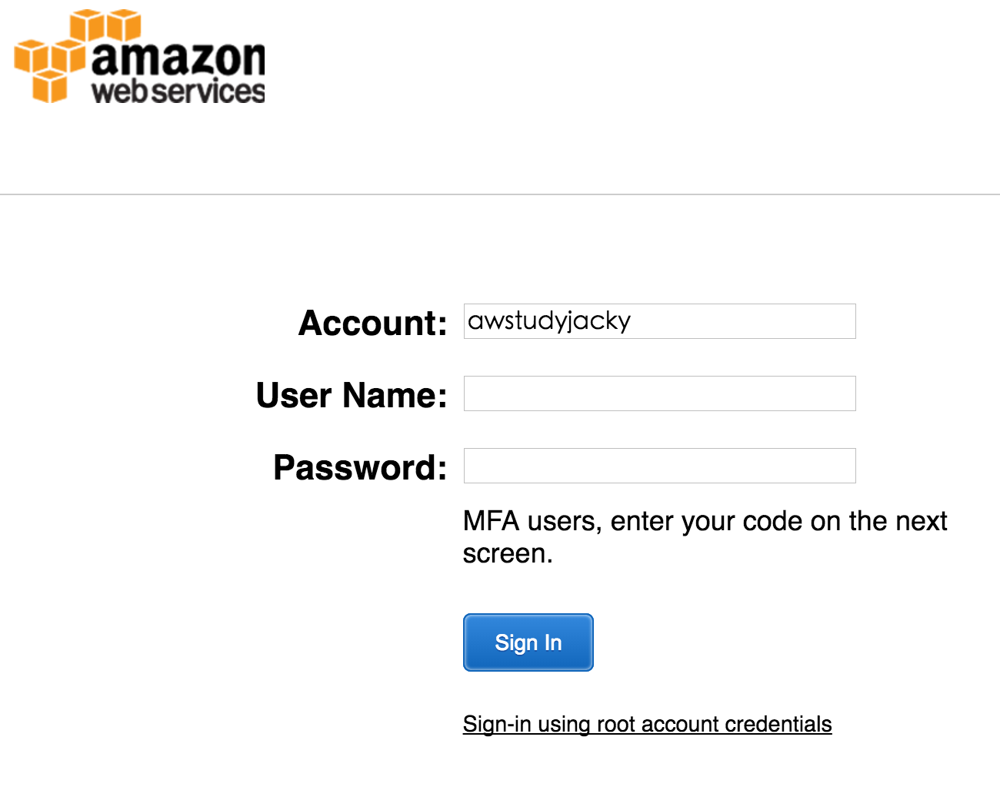
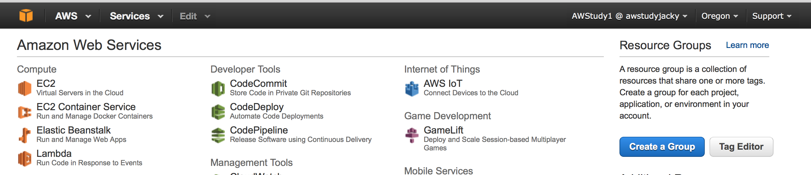

## Getting Started

---

### 開始之前先註冊一個 AWS 帳號：

- [建立 AWS 帳號參考教學](http://diary.taskinghouse.com/posts/309383-setup-free-amazon-ec2-instance)
- [使用 ssh 連線到 AWS](http://diary.taskinghouse.com/posts/310691)

---

[AWS IAM link](https://console.aws.amazon.com/iam/home)
AWS Identity and Access Management (IAM)

### Creating an Admin User and Group

- Create Group
	- Create Group > Group Name > 增加需要給 user 使用的權限
- Create Admin
	- Create User > User Name > 增加 Admin 權限

> AWS 不希望你使用 root 帳號管理 AWS 而是使用 IAM

### How Users Sign in to Your Account

#### 1. setting user password

#### 2. setting IAM users sign-in link:

> 選擇左側選單 > `Dashboard`

設定 `sign-in link` 讓其他使用者可以連線至: console.aws.amazon.com/iam

本次 sign-in link：[awstudyjacky](https://awstudyjacky.signin.aws.amazon.com/console)

|帳號|密碼|
|---|
| awstudy1 | awstudy |

#### 3. user IAM login

#### 4. test Login account / Password

> Login success!
